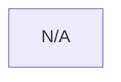

# 🧪 Aegis Forensic Quality Dashboard

**Audit Pulse**: Sat, 9 May 2026 13:50:58 -0700

## 📊 Global Score: 0% (0/6)

## 🎞️ Attack Chain Gallery

### 🎯 CA_PetiPotam_etw_rpc_efsr_5_6.evtx
**Status**: 🔴 FAIL



---
### 🎯 CA_sysmon_hashdump_cmd_meterpreter.evtx
**Status**: 🔴 FAIL


---
### 🎯 DE_1102_security_log_cleared.evtx
**Status**: 🔴 FAIL


---
### 🎯 Powershell_4104_MiniDumpWriteDump_Lsass.evtx
**Status**: 🔴 FAIL


---
### 🎯 privesc_sysmon_cve_20201030_spooler.evtx
**Status**: 🔴 FAIL


---
### 🎯 DE_ProcessHerpaderping_Sysmon_11_10_1_7.evtx
**Status**: 🔴 FAIL


---

## 🏛️ Comparison Vault (Regresson Check)

| Dataset | Golden Title | Engine Output | Containment Quality |
|:---|:---|:---|:---|
| CA_PetiPotam_etw_rpc_efsr_5_6.evtx | **Security Credential Theft** | ❌ UNKNOWN | N/A... |
| CA_sysmon_hashdump_cmd_meterpreter.evtx | **Critical System Takeover Attempt** | ❌ UNKNOWN | N/A... |
| DE_1102_security_log_cleared.evtx | **Security Credential Theft** | ❌ UNKNOWN | N/A... |
| Powershell_4104_MiniDumpWriteDump_Lsass.evtx | **Critical System Takeover Attempt** | ❌ UNKNOWN | N/A... |
| privesc_sysmon_cve_20201030_spooler.evtx | **Critical System Takeover Attempt** | ❌ UNKNOWN | N/A... |
| DE_ProcessHerpaderping_Sysmon_11_10_1_7.evtx | **Critical System Takeover Attempt** | ❌ UNKNOWN | N/A... |

## 🚩 Failure Logs

### ❌ CA_PetiPotam_etw_rpc_efsr_5_6.evtx
```text

```
### ❌ CA_sysmon_hashdump_cmd_meterpreter.evtx
```text

```
### ❌ DE_1102_security_log_cleared.evtx
```text

```
### ❌ Powershell_4104_MiniDumpWriteDump_Lsass.evtx
```text

```
### ❌ privesc_sysmon_cve_20201030_spooler.evtx
```text

```
### ❌ DE_ProcessHerpaderping_Sysmon_11_10_1_7.evtx
```text

```
